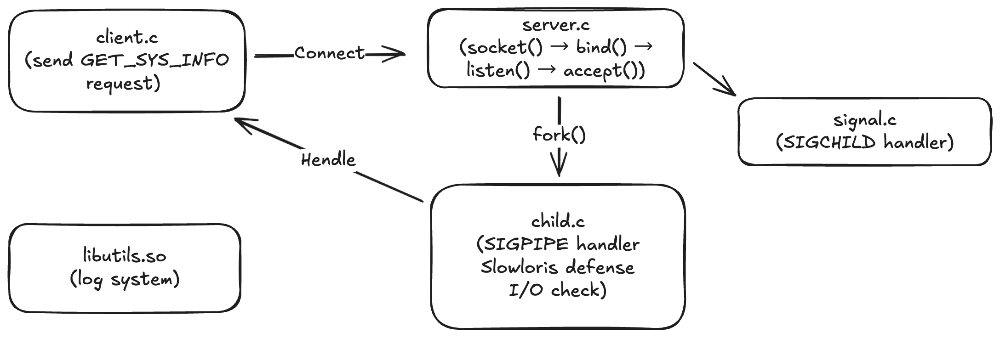

# C-Concurrent-Fork-Server

**Network System Programming - Midterm Project**
**Author:** James
**Date:** 2025-11-06
**Project Level:** Level 2-3

---

## 📋 Project Overview

This project implements a robust TCP Client-Server system based on the **fork() concurrency model**, demonstrating key system programming concepts and network robustness mechanisms.

### Core Features

- ✅ **Fork-based Concurrency** - Each client connection is handled by an independent child process
- ✅ **Dynamic Library** - `libutils.so` shared logging system
- ✅ **Dual-layer Log Control** - Compile-time (NDEBUG) + Runtime (-d flag)
- ✅ **Comprehensive Robustness** - Defense against Zombie Processes, Slowloris, SIGPIPE, Resource Exhaustion
- ✅ **Good vs. Bad Comparison** - Clearly demonstrates the value of robustness mechanisms

---

## 🏗️ System Architecture

### File Structure

```
C-Concurrent-Fork-Server/
├── src/
│   ├── libutils/       # Shared Library (Logging System)
│   │   ├── log.h
│   │   └── log.c
│   ├── server/         # Server Implementation
│   │   ├── server.c    # Main Program (socket, bind, listen, accept, fork)
│   │   ├── child.c     # Child Process Logic
│   │   └── signal.c    # SIGCHLD handler
│   └── client/         # Client Implementation
│       └── client.c
├── attacks/            # Attack Scripts
│   ├── attack_1_zombie.sh
│   ├── attack_2_slowloris.sh
│   └── attack_3_sigpipe.sh
├── tests/              # Test Suite
│   ├── test_server_good.sh
│   ├── test_sigchld.sh
│   ├── test_fork_failure.sh
│   ├── test_sigpipe.sh
│   ├── test_timeout.sh
│   └── test_io_errors.sh
├── docs/               # Documentation
│   ├── prd.md
│   ├── architecture.md
│   └── epics.md
├── CMakeLists.txt      # Build System
├── SOP.md              # Standard Operating Procedure
└── README.md           # This File
```

### System Components



---

## 🛡️ Robustness Mechanisms

### Five Implemented Protection Mechanisms

| # | Mechanism | Implementation Location | Threat Defended | Epic Story |
|---|-----------|------------------------|-----------------|------------|
| 1 | **SIGCHLD Handling** | signal.c:7-12 | Zombie Process Accumulation | Story 2.1 |
| 2 | **fork() Failure Handling** | server.c:95-100 | CPU Hot Loop, Resource Exhaustion | Story 2.2 |
| 3 | **SIGPIPE Ignoring** | child.c:16 | Write Crash | Story 2.3 |
| 4 | **SO_RCVTIMEO Timeout** | child.c:20-23 | Slowloris DoS | Story 2.4 |
| 5 | **I/O Error Checking** | child.c:46-62 | Various Network Anomalies | Story 2.5 |

### Mechanism Details

#### 1. SIGCHLD Handling (Story 2.1)

**Problem:** If the Parent does not call `wait()` after a child process exits, it becomes a zombie process (defunct).

**Solution:**
```c
// signal.c
static void sigchld_handler(int s) {
    int saved_errno = errno;
    while(waitpid(-1, NULL, WNOHANG) > 0);
    errno = saved_errno;
}
```

**Effect:**
- `server_bad`: Generates 1 zombie process per connection
- `server_good`: Automatically reclaims, 0 zombie processes

#### 2. fork() Failure Handling (Story 2.2)

**Problem:** `fork()` returns -1 when system resources are insufficient. If not handled, it leads to a 100% CPU hot loop.

**Solution:**
```c
// server.c
if (pid == -1) {
    log_info("fork() failed: %s\n", strerror(errno));
    write(client_fd, "SERVER_BUSY\n", 12);
    close(client_fd);
    sleep(1);  // Avoid hot loop
}
```

**Effect:**
- Politely notifies the client
- `sleep(1)` prevents CPU exhaustion
- Server remains stable

#### 3. SIGPIPE Ignoring (Story 2.3)

**Problem:** Writing to a closed socket triggers SIGPIPE, which terminates the program by default.

**Solution:**
```c
// child.c
signal(SIGPIPE, SIG_IGN);
```

**Effect:**
- `write()` returns -1 + EPIPE instead of crashing
- Child process can handle errors gracefully

#### 4. SO_RCVTIMEO Timeout (Story 2.4)

**Problem:** Slowloris Attack - Establishes connections but sends no data, occupying the connection pool.

**Solution:**
```c
// child.c
struct timeval tv = {.tv_sec = 5, .tv_usec = 0};
setsockopt(client_fd, SOL_SOCKET, SO_RCVTIMEO, &tv, sizeof tv);
```

**Effect:**
- Idle connections time out automatically after 5 seconds
- `read()` returns -1 + EAGAIN/ETIMEDOUT
- Child process cleans up automatically

#### 5. I/O Error Checking (Story 2.5)

**Problem:** Network anomalies (EOF, ECONNRESET, ETIMEDOUT) need graceful handling.

**Solution:**
```c
// child.c
if (valread == 0) {
    log_info("Client closed connection\n");
} else if (valread == -1) {
    if (errno == ECONNRESET) {
        log_info("Connection reset by peer\n");
    } else if (errno == ETIMEDOUT || errno == EAGAIN) {
        log_info("Read timeout\n");
    }
}
```

**Effect:**
- All errors are caught and logged
- No abnormal exits

---

## 🚀 Quick Start

### 1. Compile Project

```bash
cmake -B build
cmake --build build
```

### 2. Run Basic Tests

```bash
# Terminal 1: Start Server
./build/server_good 8080

# Terminal 2: Run Client
./build/client 127.0.0.1 8080
```

### 3. Run Full Test Suite

```bash
./tests/test_server_good.sh
```

**Expected Output:**
```
========================================
Story 2.6: server_good Comprehensive Test
========================================

✅ PASSED: Normal communication works
✅ PASSED: No zombie processes (SIGCHLD working)
✅ PASSED: fork() error handling implemented
✅ PASSED: Timeout mechanism cleaned up idle connections
✅ PASSED: Server survived SIGPIPE attack
✅ PASSED: I/O errors handled gracefully

✅ ALL TESTS PASSED!
```

---

## 🎯 Good vs. Bad Server Comparison

### server_bad (Vulnerable Version)

Compile Flag: `-DNO_ROBUST`

| Attack Scenario | Result |
|-----------------|--------|
| 20 Rapid Connect/Disconnect | ❌ Generates 20 Zombie Processes |
| 15 Idle Connections | ❌ Connection pool exhausted, cannot accept new connections |
| Rapid Disconnect Attack | ❌ Child process may crash (SIGPIPE) |
| fork() Failure | ❌ CPU 100% Hot Loop |

### server_good (Robust Version)

Compile Flag: None (All protections enabled)

| Attack Scenario | Result |
|-----------------|--------|
| 20 Rapid Connect/Disconnect | ✅ 0 Zombie Processes (SIGCHLD Auto Reclaim) |
| 15 Idle Connections | ✅ Auto cleanup after 5s (SO_RCVTIMEO) |
| Rapid Disconnect Attack | ✅ Graceful handling (SIGPIPE ignored) |
| fork() Failure | ✅ Notify client + sleep to avoid hot loop |

---

## 📊 Testing & Verification

### Test Suite

| Test Script | Purpose | Location |
|-------------|---------|----------|
| `test_server_good.sh` | Comprehensive Test (All Mechanisms) | tests/ |
| `test_sigchld.sh` | SIGCHLD Handling Verification | tests/ |
| `test_fork_failure.sh` | fork() Failure Handling | tests/ |
| `test_sigpipe.sh` | SIGPIPE Protection Verification | tests/ |
| `test_timeout.sh` | Slowloris Defense Verification | tests/ |
| `test_io_errors.sh` | I/O Error Handling Verification | tests/ |

### Attack Scripts

| Script | Attack Type | Usage |
|--------|-------------|-------|
| `attack_1_zombie.sh` | Zombie Process Attack | Demonstrates SIGCHLD Necessity |
| `attack_2_slowloris.sh` | Slowloris DoS | Demonstrates SO_RCVTIMEO Necessity |
| `attack_3_sigpipe.sh` | SIGPIPE Crash Attack | Demonstrates SIG_IGN Necessity |

### Run All Tests

```bash
# 1. Test server_good
./tests/test_server_good.sh

# 2. Run Attack Scripts Comparison
./build/server_bad 8080 &
./attacks/attack_1_zombie.sh 8080
ps aux | grep defunct  # Should see zombie processes

killall server_bad

./build/server_good 8080 &
./attacks/attack_1_zombie.sh 8080
ps aux | grep defunct  # Should see NO zombie processes
```

---

## 📦 Deliverables

### Code

- ✅ `server_good` - Production-grade Robust Server
- ✅ `server_bad` - Vulnerable Version for Comparison
- ✅ `client` - Client Program
- ✅ `libutils.so` - Shared Logging Library

### Documentation

- ✅ [SOP.md](SOP.md) - Standard Operating Procedure
- ✅ [PRD](docs/prd.md) - Product Requirement Document
- ✅ [Architecture](docs/architecture.md) - Architecture Design Document
- ✅ [Epics](docs/epics.md) - Epic Breakdown Document
- ✅ README.md - This File (Final Report)

### Test & Attack Scripts

- ✅ 6 Test Scripts (Verify All Mechanisms)
- ✅ 3 Attack Scripts (Demonstrate Comparison)

---

## 📖 Technical Specifications

### Development Environment

- **Language:** C11
- **Build System:** CMake 3.10+
- **Compiler:** GCC 11.4.0
- **Platform:** Linux (WSL2)

### Dependencies

- Standard C Library
- POSIX API (sys/socket.h, signal.h, unistd.h)
- netcat (for testing)

### Compile Options

```cmake
# server_good (Production)
add_executable(server_good server.c child.c signal.c)
target_link_libraries(server_good utils)

# server_bad (Demo)
add_executable(server_bad server.c child.c signal.c)
target_compile_definitions(server_bad PRIVATE NO_ROBUST)
target_link_libraries(server_bad utils)
```

---

## 🎓 Key Learnings

This project demonstrates the following core System Programming concepts:

1. **Process Management**
   - fork() concurrency model
   - Zombie process reclamation (waitpid)
   - Signal handling (SIGCHLD, SIGPIPE)

2. **Network Programming**
   - TCP socket communication
   - Client-Server architecture
   - Protocol design (GET_SYS_INFO)

3. **Robustness Engineering**
   - Error handling (errno)
   - Resource management (timeout, cleanup)
   - Defensive programming

4. **Build System**
   - CMake build configuration
   - Dynamic libraries (.so)
   - Conditional compilation (#ifndef)

---

## 📚 References

- [Beej's Guide to Network Programming](https://beej.us/guide/bgnet/)
- [The Linux Programming Interface](https://man7.org/tlpi/)
- [Stevens - UNIX Network Programming](http://www.unpbook.com/)

---

## 👨‍💻 Author

**James**
Network System Programming - Midterm Project
Date: 2025-11-06

---

## 📄 License

This project is for educational purposes, developed according to course requirements.

---

**Project Completion:** 100% ✅

- ✅ Epic 1: Project Foundation & Bad Server (8/8 stories)
- ✅ Epic 2: Good Server & Final Delivery (8/8 stories)
- ✅ All Tests Passed
- ✅ Complete Documentation Delivered
